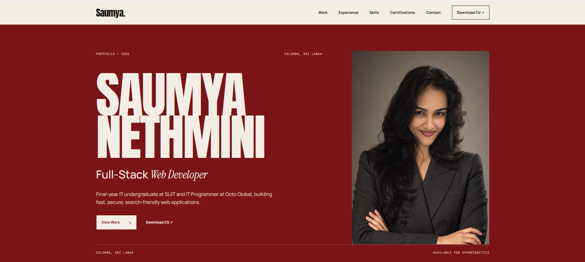

# Saumya Nethmini - Portfolio

**Full-Stack Web Developer · IT Programmer at Octo Global · Final-year IT undergraduate at SLIIT**

An editorial, magazine-style portfolio that presents my work like a printed portfolio book -
built with plain HTML, CSS and JavaScript, animated with GSAP.

---

## About

This is my personal portfolio: the place where my experience, projects, skills and
certifications come together. I'm a full-stack web developer and IT Programmer at
**Octo Global (Pvt) Ltd**, where I build client websites and APIs, fix bugs and improve
search rankings for news and gaming brands. I'm also in my final year of a
**BSc (Hons) in Information Technology at SLIIT**.

My background in SEO shapes how I build: every site should be fast, accessible and easy
to find - and this portfolio is built to the same standard.

## Contact

- **Email:** [saumya123na@gmail.com](mailto:saumya123na@gmail.com)
- **LinkedIn:** [linkedin.com/in/saumya-nethmini](https://www.linkedin.com/in/saumya-nethmini/)
- **GitHub:** [github.com/sau123nethmini](https://github.com/sau123nethmini)
- **Portfolio:** [saumya-nethmini.netlify.app](https://saumya-nethmini.netlify.app/)

---

© 2026 Saumya Nethmini. The design and content of this portfolio are my own -
please don't copy them as-is, but feel free to take inspiration.

